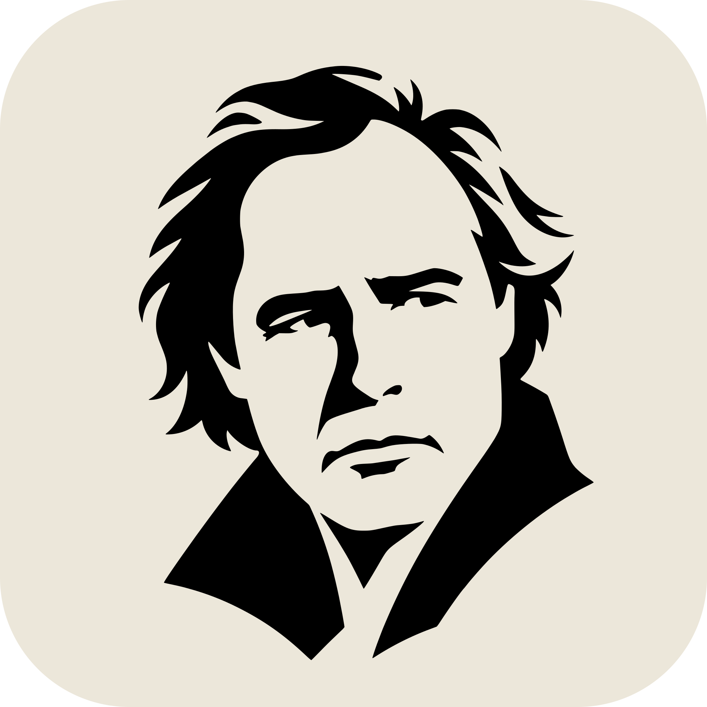

<p align="center">
  
</p>

<h1 align="center">brando</h1>

<p align="center"><em>The reusable brand pipeline — one source pulls all the strings.</em></p>

---

**brando** is a publishable Bazel module that holds the reusable brand machinery, so each
brand repo supplies only its own Spec / tokens / content and shares one hermetic pipeline.
Consumed by `savvifi/aion//brand`, `fastverk/brand`, `tomato-bazel/brand`,
`meridian-ux/brand` and `savvifi/graph//brand`.

**[The brand catalog](https://mattmarshall.github.io/brando/)** — every brand brando builds, rendered from the same `<brand>.json` each `brand_skin` emits,
with its contrast report. One self-contained page; no external requests.

## Use it

```starlark
# MODULE.bazel — resolves from registry.tbzl.dev
bazel_dep(name = "brando", version = "0.2.0")
```

```starlark
# BUILD.bazel
load("@brando//:defs.bzl", "brand_skin", "brand_svgs", "brand_icons", "brand_doc")
```

## What it provides

| rule | does |
|------|------|
| `brand_skin` | `meridian.theme.v1` textproto → `binpb` (schema-checked) + `json` |
| `brand_svgs` | run a brand's mark generator → layered SVGs (`variants`/`layers` own the `outs`) |
| `brand_icons` | rasterize a mark → PNG / `.icns` / `.ico` |
| `brand_iconcomposer` | Icon Composer `.icon` bundles |
| `brand_wordmark` | wordmark / lockup generator (typeface) |
| `brand_wordmark_glyphs` | ditto, for CONSTRUCTED letterforms — see `//marklib:wordmark` |
| `brand_office_pptx` / `brand_office_docx` | branded deck / doc templates |
| `brand_mdbook_theme` | templated mdBook theme overlay |
| `brand_doc` / `brand_latex_class` | tectonic LaTeX → PDF + a templated brand class |
| `//marklib` | shapely CSG + layered-SVG emission + Pillow rasterizer (mark-authoring lib) |
| `//marklib:tokens` | Theme → CSS custom properties |
| `//marklib:palette` | colour arithmetic + the WCAG contrast gate |
| `//marklib:diagrams` | brandbook construction / grid / clearspace plates |
| `//fonts:space_grotesk` | the shared OFL face (was vendored three times) |

A brand writes a small `gen_<mark>.py` against `@brando//marklib` and wires the rules above;
its geometry, palette, and copy stay in the brand repo.

## The name

A play on Marlon **Brando** → *The Godfather* → brand tooling that **pulls all the strings**:
one source generates every artifact (icon, wordmark, deck, doc, theme). brando's own mark is a
vectorized Brando portrait (`selfbrand/portrait/`); the marionette generators in `selfbrand/`
remain as the `marklib` pipeline dogfood.
